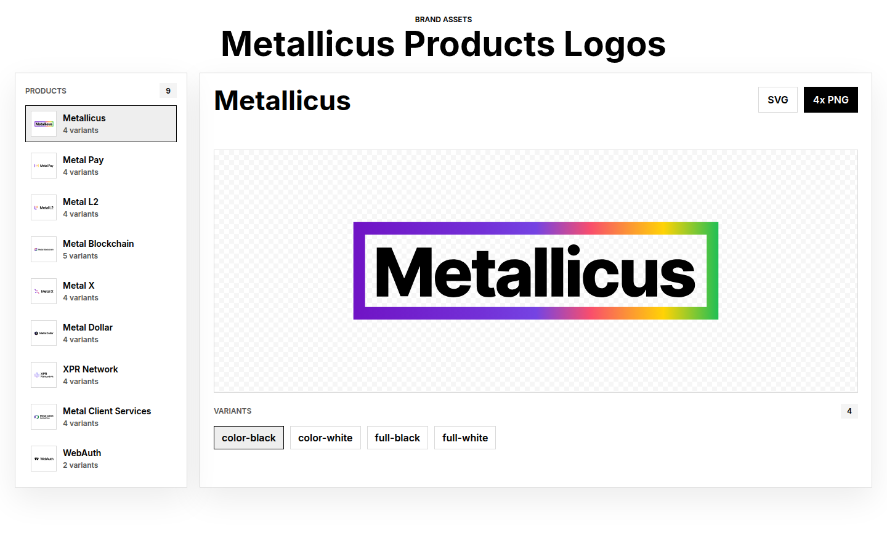

# Metallicus Brand Assets

A static, zero-dependency web app for browsing and downloading Metallicus ecosystem logo assets. Select any product from the sidebar, preview its logo variants, and export as SVG or 4× PNG.



## Products

| Product | Category | Variants |
|---------|----------|----------|
| Metallicus | Company | color-black, color-white, full-black, full-white |
| Metal Pay | Payments | color-black, color-white, full-black, full-white |
| Metal L2 | Network | color-black, color-white, full-black, full-white |
| Metal Blockchain | Network | color-black, color-white, full-black, full-white, navy |
| Metal X | Exchange | color-black, color-white, full-black, full-white |
| Metal Dollar | Stablecoin | color-black, color-white, full-black, full-white |
| XPR Network | Network | color-black, color-white, full-black, full-white |
| Metal Client Services | Services | color-black, color-white, full-black, full-white |
| WebAuth | Authentication | color-black, color-white |

## Features

- **Logo browser** — sidebar navigation with thumbnail previews for all 9 products
- **Variant switching** — toggle between color, full-black, full-white, and navy variants
- **Contextual backgrounds** — checker, dark, or soft background per variant
- **SVG download** — opens the raw SVG asset in a new tab
- **4× PNG export** — rasterises the SVG on a canvas at 4× scale and downloads the PNG
- **Responsive** — adapts from widescreen down to 320 px

## Running locally

The app is plain HTML/CSS/JavaScript with no build step. Because it uses ES modules and `fetch`, it must be served over HTTP (not opened directly as a `file://` URL).

```bash
# Python (built-in)
python3 -m http.server

# Node (npx)
npx serve .

# any other static file server
```

Then open `http://localhost:8000` (or whichever port the server reports).

## Project structure

```
├── index.html               # App shell
├── app.js                   # Application logic (ES module)
├── styles.css               # Styles
├── assets/
│   └── logos/
│       ├── metallicus/
│       ├── metal-pay/
│       ├── metal-l2/
│       ├── metal-blockchain/
│       ├── metal-x/
│       ├── metal-dollar/
│       ├── xpr-network/
│       ├── metal-client-services/
│       └── webauth/
└── docs/
    └── preview.png          # UI screenshot
```

## Asset naming convention

SVG files follow the pattern `{product-id}-{variant-id}.svg`, for example:

- `metal-blockchain-color-black.svg`
- `metal-blockchain-navy.svg`
- `webauth-color-white.svg`

## Tech

| Layer | Choice |
|-------|--------|
| Markup | HTML5 |
| Styles | CSS custom properties, CSS Grid |
| Logic | Vanilla JavaScript (ES2022 modules) |
| Build | None |
| Runtime deps | Browser APIs only (`fetch`, `DOMParser`, `Canvas`, `Blob`) |
